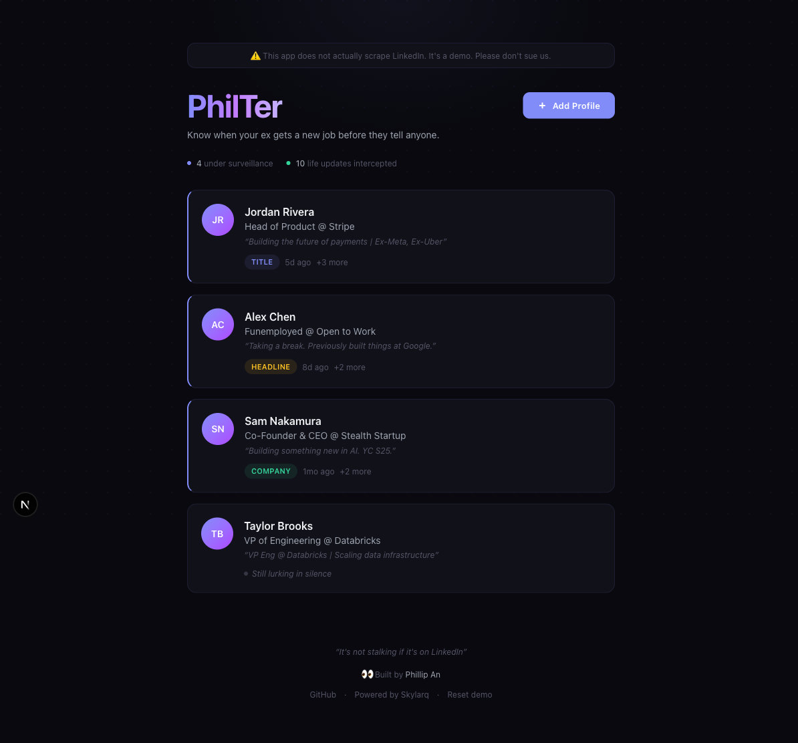
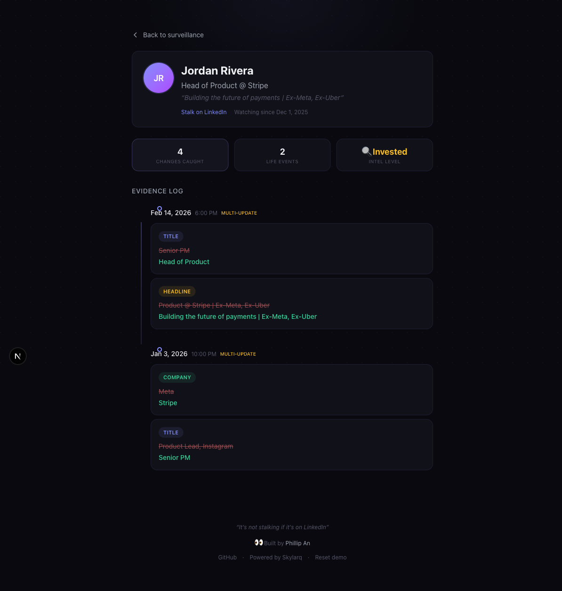
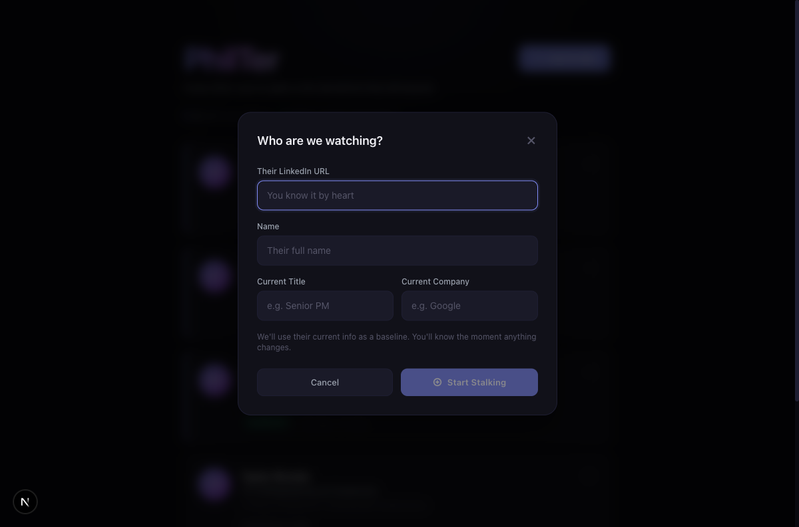

# PhilTer

Know when your ex gets a new job before they tell anyone.

Track LinkedIn profiles for job changes, title updates, and headline rewrites. Get notified the moment something changes. For "market research" purposes, obviously.

**Built by [Phillip An](https://linkedin.com/in/phillipan)**



## How it works

Add LinkedIn profiles to your watchlist. PhilTer tracks changes to their job title, company, and headline over time. When something changes, you get an email.

Ships with demo profiles so you can explore immediately.

### Features

- **Surveillance dashboard** — monitor multiple profiles at a glance
- **Change detection** — tracks title, company, and headline updates
- **Visual diff timeline** — see exactly what changed, old vs new
- **Email alerts** — get notified when someone updates their profile (via Resend)
- **Demo mode** — pre-loaded sample profiles with realistic change histories
- **Local storage** — all data stays in your browser, no database needed





## Tech stack

- **Frontend:** Next.js 15, React 19, Tailwind CSS 4
- **Email:** [Resend](https://resend.com)
- **Data:** localStorage (no backend required)

## Run locally

```bash
git clone https://github.com/phillipan14/philter.git
cd philter
npm install
npm run dev
```

Open [http://localhost:3000](http://localhost:3000). Demo profiles are pre-loaded.

### Optional: Email notifications

To enable email alerts, add a [Resend](https://resend.com) API key:

```bash
echo "RESEND_API_KEY=re_your_key_here" > .env.local
```

## Deploy to Vercel

[](https://vercel.com/new/clone?repository-url=https://github.com/phillipan14/philter&env=RESEND_API_KEY&envDescription=Resend%20API%20key%20for%20email%20notifications&envLink=https://resend.com)

## License

MIT
